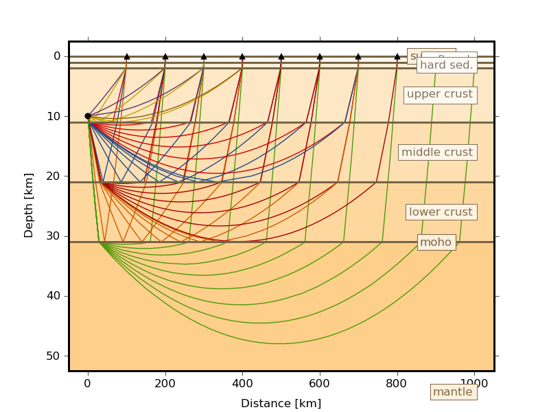

Cake
====

Cake is a module which can be used to solve classical seismic ray theory problems for layered earth models (layer cake models).

For various seismic phases it can calculate:

* arrival times
* ray paths
* reflection and transmission coefficients
* take-off and incidence angles
* geometrical spreading factors

Computations are done for a spherical earth.
Cake can either be run as a command line tool or used as a Python module. Both is demonstrated in the examples below.

Invocation
----------

.. program:: cake

::  
    
    cake <command> [options]

where ``<command>`` is one of the following subcommands:

**print**

    print detailed description of earth model, seismic phase definition, or material parameters.

**arrivals**

    calculate and print travel times and and propation path information.

**plot-xt**

    plot arrival times over epicentral distance.

**plot-xp**

    plot ray parameter over epicentral distance.
    
**plot-rays**

    plot ray propagation paths.

**plot**

    plot arrival times over epicentral distance together with ray propagation paths.

For further help on any of these commands and a list of the available options, run ``cake <command> --help``.

Options
^^^^^^^

.. option:: -h, --help

    show help message and exit 

.. option:: --phases=PHASE1,PHASE2,...

    comma separated list of seismic phase definition(s) in cake syntax

.. option:: --model=FILENAME
    
    load model from file named FILENAME

.. option:: --format=FORMAT
    
    set model file format (available: ``nd``, ``hyposat``; default: ``nd``)

.. option:: --crust2loc=LAT,LON
    
    set model from CRUST2.0 profile at location (LAT,LON)

.. option:: --sdepth=FLOAT

    source depth [km] (default: 0)

.. option:: --rdepth=FLOAT

    receiver depth [km] (default: 0)

.. option:: --distances=DISTANCES

    surface distances as ``start:stop:n`` or ``dist1,dist2,...`` [km]

.. option:: --degrees

    distances are in [deg] instead of [km], velocities in [deg/s] instead of [km/s]

.. option:: --vred=FLOAT

    velocity for time reduction in plot [km/s]

Command Line Examples
---------------------

Plot P and p Phases
^^^^^^^^^^^^^^^^^^^^^^

Ten receiver distances ranging from 100 km to 1000 km and a source depth of 10km.

::

    cake plot-rays --crust2loc=45,10 --phases=P,p --sdepth=10 --distances=100:1000:10

This command will produce the following image:

The option ``--crust2loc`` refers to the :py:mod:`pyrocko.crust2x2` module and expects latitude and longitude of the source location.

Python Script Examples
----------------------

Calculate P-phase arrivals
^^^^^^^^^^^^^^^^^^^^^^^^^^

The following Python script calculates arrival times for the P-phase emitted by an event in a depth of 300km.

::
    
    '''
    Calculate P-phase arrivals.
    '''

    from pyrocko import cake
    import numpy as num
    km = 1000.

    # Load 'nd'-format earth model.
    cake.mod = cake.load_model('prem.nd','nd')

    # Source depth [m].
    source_depth = 300. * km

    # Distances as a numpy array [deg].
    distances = num.linspace(1500,3000,16)*km * cake.m2d

    # Define the phase to use.
    Phase = cake.PhaseDef('P')

    # calculate distances and arrivals and print them:
    print 'distance [km]      time [s]'
    for arrival in cake.mod.arrivals(distances, phases=Phase, zstart=source_depth):
        print '%13g %13g' % (arrival.x*cake.d2m/km, arrival.t)

