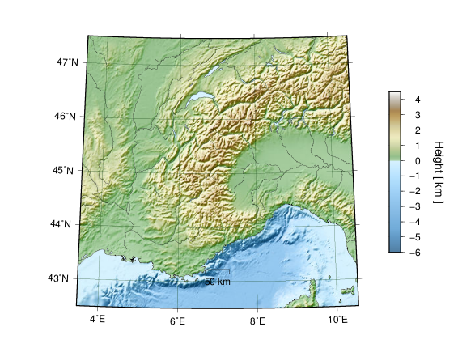

GmtPy - A Python interface to GMT 4/5
=====================================

Pyrocko's :mod:`gmtpy <pyrocko.plot.gmtpy>` module  provides seamless integration of
`GMT <http://gmt.soest.hawaii.edu/>`_ plotting into Python programs. On top of
that it provides opt-in autoscaling, automatic tick increment determination,
layout management, and more. GmtPy is the base for Pyrocko's higher level
:py:mod:`automap <pyrocko.plot.automap>` functionality (see also:
:doc:`../plotting`). 

.. toctree::
   :maxdepth: 2

   introduction
   tutorial
   remarks
