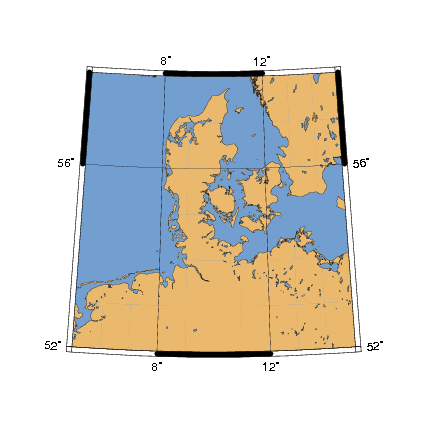
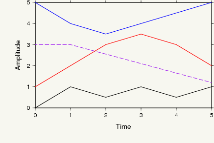
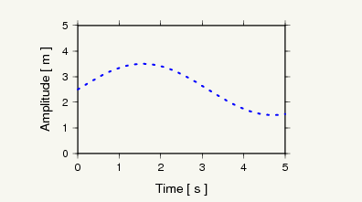
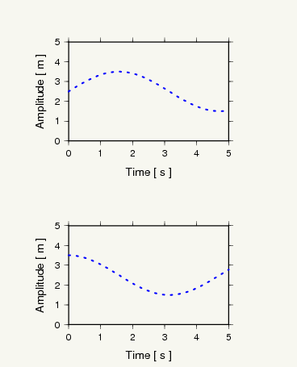
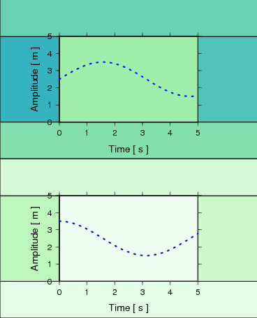

Tutorial
========

.. py:currentmodule:: pyrocko.plot.gmtpy

This tutorial assumes that you are familiar with `Python
<http://www.python.org/>`_ as well as with `GMT
<https://www.generic-mapping-tools.org/>`_. If not, to avoid frustration, you may first
want to dive into the `Python tutorial <http://docs.python.org/tutorial/>`_ or the
`GMT tutorial <https://docs.generic-mapping-tools.org/5.4/GMT_Tutorial.html>`_.

Example 1: Basic usage
----------------------

The most basic usage of GmtPy is to use it as a replacement for plain GMT shell scripts.

Here is a simple shell script producing the map above with a single call to :program:`pscoast` (`pscoast manual <https://docs.generic-mapping-tools.org/5.4/pscoast.html>`_), which we would then like to translate into a Python script.

Shell script version
....................

::

    #!/bin/bash
    gmtset BASEMAP_TYPE = fancy \
           PAPER_MEDIA = a4+ \
           PAGE_ORIENTATION = portrait

    pscoast -R5/15/52/58 \
            -JB10/55/55/60/10c \
            -B4g4 \
            -Df \
            -S114/159/207 \
            -G233/185/110 \
            -Wthinnest > example1.eps

    epstopdf --outfile=example1.pdf example1.eps

Python version
..............
 
.. literalinclude :: /../../examples/gmtpy_example1.py
    :language: python

How GmtPy handles gmtdefaults variables
........................................

* GmtPy uses its own consistent built-in set of gmtdefaults parameters, such that running a GmtPy script on a different machine, or from a different user account should not change the appearance of the output graphics.
* The keyword argument `config` of :py:class:`GMT` takes a dict with all the :program:`gmtdefaults` (`gmtdefaults manual <https://docs.generic-mapping-tools.org/5.4/gmtdefaults.html>`_) variables which you want to override.
* The defaults are selected with the hypothetical default goal of producing graphics to be included in publications or presentations. In particular, EPS output (``PAPER_MEDIA = a4+``) and portrait page orientation  (``PAGE_ORIENTATION = portrait``) are selected as defaults. You can get the complete list of defaults with:: 
   
        from pyrocko.plot import gmtpy
        print(gmtpy.gmtdefaults_as_text())

* The :program:`gmtset` (`gmtset manual <https://docs.generic-mapping-tools.org/5.4/gmtset.html>`_) utility should not be used with GmtPy.
* GmtPy ignores any ``.gmtdefaults`` files.

How method arguments are turned into command line arguments by GmtPy
....................................................................

* When GMT programs are run via methods of the :py:class:`GMT` object, any keyword arguments are translated into option arguments for the GMT program.
* Any non-keyword arguments are also handed over to the GMT program. So writing ``'-Df'`` is equivalent to writing ``D='f'``
* Numbers and everything else (except tuples and boolean values, see below and example 2) which is given as a keyword argument is turned into a string using Python's ``str()`` function before being passed to the GMT command. So writing ``S=100.5`` is equivalent to writing ``S='100.5'``.
* Tuples in the keyword arguments like ``(114,159,207)`` are translated into slash-separated strings like ``'144/159/207'`` by GmtPy.
* See documentation of :py:meth:`GMT.__getattr__` for details

Example 2: How to get data from Python into GMT
-----------------------------------------------

This example illustrates the use of different methods to pipe data to the GMT programs.

Python code
...........

.. literalinclude :: /../../examples/gmtpy_example2.py
    :language: python

Remarks
.......

* **Important:** Appropriate appending of ``-O`` and ``-K`` is handled automatically.
* With ``in_columns`` and ``in_rows`` any iterable can be used. E.g. !NumPy arrays!
* See documentation of :py:meth:`GMT.__getattr__` for details

----

Example 3: Using default layouts
--------------------------------

This example shows how to use a default layout to gain full control over the placement of a single plot on the output page.

Python code
...........

.. literalinclude :: /../../examples/gmtpy_example3.py
    :language: python

Remarks
.......

* The default layouts are tuned to the ``PAPER_MEDIA`` and ``PAGE_ORIENTATION``
  :program:`gmtdefaults` (`gmtdefaults manual <https://docs.generic-mapping-tools.org/5.4/gmtdefaults.html>`_)
  variables. See the documentation for the :py:meth:`GMT.default_layout` method for details.

----

Example 4: Creating a custom layout
-----------------------------------

How to set up a custom layout to nicely place two plots on one page.

Python code
...........

.. literalinclude :: /../../examples/gmtpy_example4.py
    :language: python

Explanation
...........

* Layouts may be arbitrarily nested. In this example two :py:class:`FrameLayout` objects are placed in the widgets of a :py:class:`GridLayout`.
* Three basic layout classes are available: :py:class:`FrameLayout`, :py:class:`GridLayout` and :py:class:`CenterLayout`. See also documentation for :py:class:`Widget`, from which they all inherit.
* The :py:meth:`GridLayout.set_widget` method is used to insert the two :py:class:`FrameLayout` objects into it.
* The layout hierarchy must be set up and configured completely *first*. After that, use it to place the plots.
 

How to debug the layout design
..............................

In the above example, uncommenting the line::

    print(layout)

will print the sizes and positions of all widgets in the layout::

    gmtpy.GridLayout (368.504 x 455.497) (0, 0)
      gmtpy.FrameLayout (368.504 x 227.749) (0, 227.749)
        gmtpy.Widget (85.0394 x 122.634) (0, 280.306)
        gmtpy.Widget (85.0394 x 122.634) (283.465, 280.306)
        gmtpy.Widget (368.504 x 52.5574) (0, 402.94)
        gmtpy.Widget (368.504 x 52.5574) (0, 227.749)
        gmtpy.Widget (198.425 x 122.634) (85.0394, 280.306)
      gmtpy.FrameLayout (368.504 x 227.749) (0, 0)
        gmtpy.Widget (85.0394 x 122.634) (0, 52.5574)
        gmtpy.Widget (85.0394 x 122.634) (283.465, 52.5574)
        gmtpy.Widget (368.504 x 52.5574) (0, 175.191)
        gmtpy.Widget (368.504 x 52.5574) (0, 0)
        gmtpy.Widget (198.425 x 122.634) (85.0394, 52.5574)

If you want to visually inspect the layout, you may additionally uncomment the line containing

::

    gmt.draw_layout(layout)

The output graphics will then be underlaid by colored boxes, each representing one of the  widgets in the layout:

