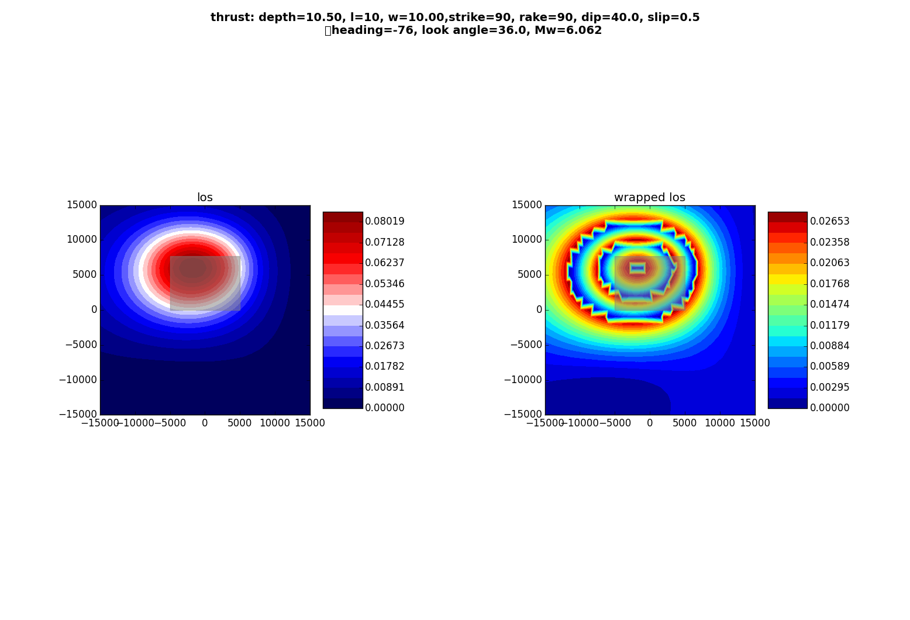
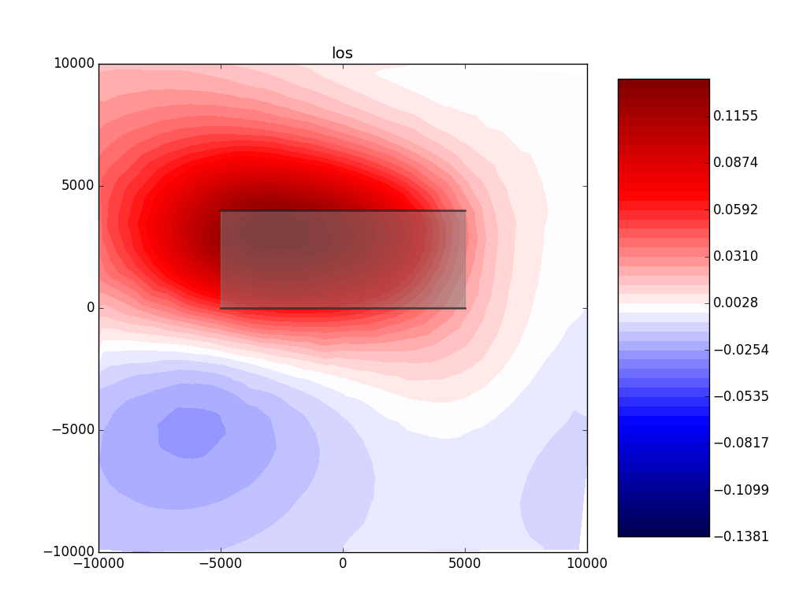

Forward Modeling synthetic seismograms and displacements
========================================================

Calculate synthetic seismograms from a local store
--------------------------------------------------

.. highlight:: python

It is assumed that a :class:`~pyrocko.gf.store.Store` with store ID
*crust2_dd* has been downloaded in advance. A list of currently available
stores can be found at http://kinherd.org/gfs.html as well as how to download
such stores.

Further API documentation for the utilized objects can be found at :class:`~pyrocko.gf.targets.Target`,
:class:`~pyrocko.gf.seismosizer.LocalEngine` and :class:`~pyrocko.gf.seismosizer.DCSource`.

::

    from pyrocko.gf import LocalEngine, Target, DCSource
    from pyrocko import trace
    from pyrocko.gui_util import PhaseMarker

    # We need a pyrocko.gf.Engine object which provides us with the traces
    # extracted from the store. In this case we are going to use a local
    # engine since we are going to query a local store.
    engine = LocalEngine(store_superdirs=['/media/usb/stores'])

    # The store we are going extract data from:
    store_id = 'crust2_dd'

    # Define a list of pyrocko.gf.Target objects, representing the recording
    # devices. In this case one station with a three component sensor will
    # serve fine for demonstation.
    channel_codes = 'ENZ'
    targets = [
        Target(
            lat=10.,
            lon=10.,
            store_id=store_id,
            codes=('', 'STA', '', channel_code))
        for channel_code in channel_codes]

    # Let's use a double couple source representation.
    source_dc = DCSource(
        lat=11.,
        lon=11.,
        depth=10000.,
        strike=20.,
        dip=40.,
        rake=60.,
        magnitude=4.)

    # Processing that data will return a pyrocko.gf.Reponse object.
    response = engine.process(source_dc, targets)

    # This will return a list of the requested traces:
    synthetic_traces = response.pyrocko_traces()

    # In addition to that it is also possible to extract interpolated travel times
    # of phases which have been defined in the store's config file.
    store = engine.get_store(store_id)

    markers = []
    for t in targets:
        dist = t.distance_to(source_dc)
        depth = source_dc.depth
        arrival_time = store.t('p', (depth, dist))
        m = PhaseMarker(tmin=arrival_time,
                        tmax=arrival_time,
                        phasename='p',
                        nslc_ids=(t.codes,))
        markers.append(m)

    # Finally, let's scrutinize these traces.
    trace.snuffle(synthetic_traces, markers=markers)

.. figure :: ../_static/gf_synthetic.png
    :align: center
    :alt: Synthetic seismograms calculated through pyrocko.gf

    Synthetic seismograms calculated through :class:`pyrocko.gf` displayed in :doc:`../apps_snuffler`. The three traces show the east, north and vertical synthetical displacement stimulated by a double-couple source at 155 km distance.

Calculate spatial surface displacement from a local store
----------------------------------------------------------

In this example we create a :class:`~pyrocko.gf.seismosizer.RectangularSource` and compute the spatial static/geodetic displacement caused by that rupture.

We will utilize :class:`~pyrocko.gf.seismosizer.LocalEngine`, :class:`~pyrocko.gf.targets.StaticTarget` and :class:`~pyrocko.gf.targets.SatelliteTarget`.

.. figure:: ../_static/gf_static_displacement.png
    :align: center
    :alt: Static displacement from a strike-slip fault calculated through pyrocko

    Synthetic surface displacement from a vertical strike-slip fault, with a N104W azimuth, in the Line-of-sight (LOS), east, north and vertical directions. LOS as for Envisat satellite (Look Angle: 23., Heading:-76). Positive motion toward the satellite. 

::

    from pyrocko.gf import LocalEngine, StaticTarget, SatelliteTarget,\
        RectangularSource
    import numpy as num

    # distance in kilometer
    km = 1e3

    # Ignite the LocalEngine and point it to fomosto stores stored on a
    # USB stick, for this example we use a static store with id 'static_store'
    engine = LocalEngine(store_superdirs=['/media/usb/stores'])
    store_id = 'static_store'

    # We define an extended source, in this case a rectangular geometry
    # Centroid UTM position is defined relatively to geographical lat, lon position
    # Purely lef-lateral strike-slip fault with an N104W azimuth.  
    rect_source = RectangularSource(
        lat=0., lon=0.,
        north_shift=0., east_shift=0., depth=6.5*km,
        width=5*km, length=8*km,
        dip=90., rake=0., strike=104.,
        slip=1.)

    # We will define 1000 randomly distributed targets.
    ntargets = 1000

    # We initialize the satellite target and set the line of sight vectors direction
    # Example of the Envisat satellite
    look = 23. # angle between the LOS and the vertical 
    heading = -76 # angle between the azimuth and the east (anti-clock) 
    theta = num.empty(ntargets) # Vertical LOS from horizontal
    theta.fill(num.deg2rad(90.- look)) 
    phi = num.empty(ntargets)  # Horizontal LOS from E in anti-clokwise rotation
    phi.fill(num.deg2rad(90-heading))

    satellite_target = SatelliteTarget(
        north_shifts=(num.random.rand(ntargets)-.5) * 30. * km,
        east_shifts=(num.random.rand(ntargets)-.5) * 30. * km,
        tsnapshot=60,
        interpolation='nearest_neighbor',
        phi=phi,
        theta=theta)

    # The computation is performed by calling process on the engine
    result = engine.process(rect_source, [satellite_target])

    # Helper function for plotting the displacement
    def plot_static_los_result(result, target=0):
        import matplotlib.pyplot as plt

        N = result.request.targets[target].coords5[:, 2]
        E = result.request.targets[target].coords5[:, 3]
        result = result.results_list[0][target].result
        
        # get the component names
        components = result.keys()
        fig, _ = plt.subplots(int(len(components)/2),int(len(components)/2))
        
        vranges = [(result[k].max(),
                    result[k].min()) for k in components]

        for dspl, ax, vrange in zip(components, fig.axes, vranges):

            lmax = num.abs([num.min(vrange), num.max(vrange)]).max()
            levels = num.linspace(-lmax, lmax, 50)

            # plot interpolated points in map view with tricontourf 
            cmap = ax.tricontourf(E, N, result[dspl],
                                  cmap='seismic', levels=levels)

            ax.set_title(dspl+' [m]')
            ax.set_aspect('equal')
        
            # We plot the modeled fault
            n, e = rect_source.outline(cs='xy').T
            ax.fill(e, n, color=(0.5, 0.5, 0.5), alpha=0.5)
        
            fig.colorbar(cmap, ax=ax, aspect=5)
        
        # adjust spacing between subplots
        fig.tight_layout()
        plt.show()

    plot_static_los_result(result)

Calculate forward model of thrust event and display wrapped phase
-----------------------------------------------------------------

In this example we compare the synthetic unwappred and wrapped LOS displacements caused by a thrust rupture.

    Synthetic LOS displacements from a south-dipping thrust fault. LOS as for Sentinel-1 satellite (Look Angle: 36., Heading:-76). Positive motion toward the satellite. Left: unwrapped phase. Right: Wrapped phase.

::

    from pyrocko.gf import LocalEngine, StaticTarget, SatelliteTarget,\
        RectangularSource
    import numpy as num

    # distance in kilometer
    km = 1e3

    # Ignite the LocalEngine and point it to fomosto stores stored on a
    # USB stick, for this example we use a static store with id 'static_store'
    store_id = 'static_store'
    engine = LocalEngine(store_superdirs=['/media/usb/stores'],default_store_id=store_id)

    # We want to reproduce the USGS Solution of the event
    d= 10.5; strike=90; dip=40.; l=10; W=10; rake=90; slip=.5

    # We compute the magnitude of the event
    potency=l*km*W*km*slip
    m0=potency*31.5e9
    mw=(2./3)*num.log10(m0)-6.07

    # We define an extended source, in this case a rectangular geometry
    # horizontal distance 
    # The centorid north position depends on its dip angle and its width.
    n=num.cos(num.deg2rad(dip))*W/2

    thrust = RectangularSource(
        north_shift=n*km, east_shift=0.,
        depth=d*km, width=W*km, length=l*km,
        dip=dip, rake=rake, strike=strike,
        slip=slip)

    # We define a grid for the targets.
    left,right,bottom,top=-15*km,15*km,-15*km,15*km
    ntargets = 50000 

    # We initialize the satellite target and set the line of site vectors
    # Case example of the Sentinel-1 satellite: 
    # Heading: -166 (anti clokwise rotation from east)
    # Average Look Angle: 36 (from vertical)
    heading=-76
    look=36.
    phi = num.empty(ntargets) # Horizontal LOS from E in anti-clokwise rotation
    theta = num.empty(ntargets)  # Vertical LOS from horizontal
    phi.fill(num.deg2rad(90-heading))    
    theta.fill(num.deg2rad(90.-look))

    satellite_target = SatelliteTarget(
        north_shifts = rnd.uniform(bottom, top, ntargets),
        east_shifts= rnd.uniform(left, right, ntargets),
        tsnapshot=60,
        interpolation='nearest_neighbor',
        phi=phi,
        theta=theta)

    # The computation is performed by calling process on the engine
    result = engine.process(thrust, [satellite_target])

    # Helper function for plotting the displacement
    def plot_static_los_result(result, target=0):
        import matplotlib.pyplot as plt
        import matplotlib.cm as cm

        # get forward model from engine
        N = result.request.targets[target].coords5[:, 2]
        E = result.request.targets[target].coords5[:, 3]
        result = result.results_list[0][target].result

        fig, _ = plt.subplots(1,2,figsize=(8,4))
        fig.suptitle("thrust: depth={:0.2f}, l={}, w={:0.2f},strike={}, rake={}, dip={}, slip={}\n\
            heading={}, look angle={}, Mw={:0.3f}"\
         .format(d,l,W,strike,rake,dip,slip,heading,look,mw), 
         fontsize=14, fontweight='bold')

        # Plot unwrapped LOS displacements
        ax = fig.axes[0]
        # We shift the relative LOS displacements
        los = result['displacement.los'] - result['displacement.los'].min()
        losrange = [(los.max(),los.min())] 
        losmax = num.abs([num.min(losrange), num.max(losrange)]).max()
        levels = num.linspace(0, losmax, 50)

        cmap = ax.tricontourf(E, N, los , 
            cmap='seismic', levels=levels)

        ax.set_title('los')
        ax.set_aspect('equal')
        
        # We plot the fault projection to the surface   
        n, e = thrust.outline(cs='xy').T
        ax.fill(e, n, color=(0.5, 0.5, 0.5), alpha=0.5)
        # We underline the tip of the thrust 
        ax.plot(e[:2],n[:2],linewidth=2.,color='black',alpha=0.5)

        fig.colorbar(cmap,ax=ax,orientation='vertical',aspect=5, shrink=0.5)

        # We plot wrapped phase 
        ax = fig.axes[1]
        # We wrap the phase between 0 and 0.028 mm
        wavelenght = 0.028
        wrapped_los= num.mod(los,wavelenght)
        levels = num.linspace(0,wavelenght, 50)

        # ax.tricontour(E, N, wrapped_los,
        #   map='gist_rainbow', levels=levels, colors='k')
        cmap = ax.tricontourf(E, N, wrapped_los,\
            cmap='gist_rainbow', levels=levels, interpolation='bicubic')

        ax.set_xlim(left,right)
        ax.set_ylim(bottom,top)

        ax.set_title('wrapped los')
        ax.set_aspect('equal')

        # We plot the fault projection to the surface   
        n, e = thrust.outline(cs='xy').T
        ax.fill(e, n, color=(0.5, 0.5, 0.5), alpha=0.5)
        # We underline the tiip of the fault
        ax.plot(e[:2],n[:2],linewidth=2.,color='black',alpha=0.5)

        fig.colorbar(cmap,orientation='vertical',shrink=0.5, aspect=5)
        fig.tight_layout()
        plt.show()

    plot_static_los_result(result)

Combining severals sources 
---------------------------
In this example we combine two rectangular sources and plot the forward model in profile.

    Synthetic LOS displacements from a flower-structure made of one strike-slip fault and one thrust fault. LOS as for Sentinel-1 satellite (Look Angle: 36., Heading:-76). Positive motion toward the satellite. 

::

    from pyrocko.gf import LocalEngine, StaticTarget, SatelliteTarget,\
        RectangularSource
    import numpy as num
    from pyrocko import gf
    from pyrocko.guts import List
    import numpy.random as rnd

    # distance in kilometer
    km = 1e3

    # We de fine the calss CombiSource to combine several sources in the engine
    class CombiSource(gf.Source):
        discretized_source_class = gf.DiscretizedMTSource

        subsources = List.T(gf.Source.T())

        def __init__(self, subsources=[], **kwargs):
            if subsources:

                lats = num.array([subsource.lat for subsource in subsources], dtype=num.float)
                lons = num.array([subsource.lon for subsource in subsources], dtype=num.float)

                if num.all(lats == lats[0]) and num.all(lons == lons[0]):
                    lat, lon = lats[0], lons[0]
                else:
                    lat, lon = center_latlon(subsources)

                depth = float(num.mean([p.depth for p in subsources]))
                t = float(num.mean([p.time for p in subsources]))
                kwargs.update(time=t, lat=float(lat), lon=float(lon), depth=depth)

            gf.Source.__init__(self, subsources=subsources, **kwargs)

        def get_factor(self):
            return 1.0

        def discretize_basesource(self, store, target=None):

            dsources = []
            t0 = self.subsources[0].time
            for sf in self.subsources:
                assert t0 == sf.time
                ds = sf.discretize_basesource(store, target)
                ds.m6s *= sf.get_factor()
                dsources.append(ds)

            return gf.DiscretizedMTSource.combine(dsources)

    # distance in kilometer
    km = 1e3
    # We define a grid for the targets.
    left,right,bottom,top=-10*km,10*km,-10*km,10*km
    ntargets = 1000 

    # Ignite the LocalEngine and point it to fomosto stores stored on a
    # USB stick, for this example we use a static store with id 'static_store'
    store_id = 'static_store'
    engine = LocalEngine(store_superdirs=['/media/usb/stores'],default_store_id=store_id)

    # We define two finite sources
    # The first one is a purely vertical strike-slip fault
    strikeslip = RectangularSource(
        north_shift=0, east_shift=0.,
        depth=6*km, width=4*km, length=10*km,
        dip=90.,rake=0., strike=90.,
        slip=1.)

    # The second one is a ramp connecting to the root of the strike-slip fault
    # ramp north shift (n) and width (w) depend on its dip angle and on
    # the strike slip fault width   
    n, w = 2/num.tan(num.deg2rad(45)), 2*(2./(num.sin(num.deg2rad(45))))
    thrust = RectangularSource(
        north_shift=n*km, east_shift=0.,
        depth=6*km, width=w*km, length=10*km,
        dip=45, rake=90., strike=90,
        slip=0.5)

    # We initialize the satellite target and set the line of site vectors
    # Case example of the Sentinel-1 satellite: 
    # Heading: -166 (anti clokwise rotation from east)
    # Average Look Angle: 36 (from vertical)
    heading=-76
    look=36.
    phi = num.empty(ntargets) # Horizontal LOS from E in anti-clokwise rotation
    theta = num.empty(ntargets)  # Vertical LOS from horizontal
    phi.fill(num.deg2rad(90-heading))    
    theta.fill(num.deg2rad(90.-look))

    satellite_target = SatelliteTarget(
        north_shifts = rnd.uniform(bottom, top, ntargets),
        east_shifts= rnd.uniform(left, right, ntargets),
        tsnapshot=60,
        interpolation='nearest_neighbor',
        phi=phi,
        theta=theta)

    # We combine the two sources here
    patches = [strikeslip,thrust];
    sources = CombiSource(subsources=patches)

    # The computation is performed by calling process on the engine
    result = engine.process(sources, [satellite_target])

    def plot_static_los_profile(result,strike,l,w,x0,y0):
        import matplotlib.pyplot as plt
        import matplotlib.cm as cm
        import matplotlib.colors as mcolors
        fig, _ = plt.subplots(1,2,figsize=(8,4))

        # strike,l,w,x0,y0: strike, length, width, x, and y position 
        # of the profile
        strike=num.deg2rad(strike)
        # We define the parallel and perpendicular vectors to the profile
        s=[num.sin(strike),num.cos(strike)]
        n=[num.cos(strike),-num.sin(strike)]
        
        # We define the boundaries of the profile 
        ypmax,ypmin=l/2,-l/2
        xpmax,xpmin=w/2,-w/2

        # We define the corners of the profile
        xpro,ypro = num.zeros((7)),num.zeros((7))
        xpro[:] = x0-w/2*s[0]-l/2*n[0],x0+w/2*s[0]-l/2*n[0],\
        x0+w/2*s[0]+l/2*n[0],x0-w/2*s[0]+l/2*n[0],x0-w/2*s[0]-l/2*n[0],\
        x0-l/2*n[0],x0+l/2*n[0]
        
        ypro[:] = y0-w/2*s[1]-l/2*n[1],y0+w/2*s[1]-l/2*n[1],\
        y0+w/2*s[1]+l/2*n[1],y0-w/2*s[1]+l/2*n[1],y0-w/2*s[1]-l/2*n[1],\
        y0-l/2*n[1],y0+l/2*n[1]

        # We get the forward model from the engine
        N = result.request.targets[0].coords5[:, 2]
        E = result.request.targets[0].coords5[:, 3]
        result = result.results_list[0][0].result

        # We first plot the surface displacements in map view
        ax = fig.axes[0]
        los = result['displacement.los']
        losrange = [(los.max(),los.min())] 
        losmax = num.abs([num.min(losrange), num.max(losrange)]).max()
        levels = num.linspace(-losmax, losmax, 50)

        cmap = ax.tricontourf(E, N, los , 
            cmap='seismic', levels=levels)

        for sourcess in patches:
            fn, fe = sourcess.outline(cs='xy').T
            ax.fill(fe, fn, color=(0.5, 0.5, 0.5), alpha=0.5)
            ax.plot(fe[:2],fn[:2],linewidth=2.,color='black',alpha=0.5)

        # We plot the limits of the profile in map view
        ax.plot(xpro[:],ypro[:],color = 'black',lw = 1.)
        # plot colorbar
        fig.colorbar(cmap,ax=ax,orientation='vertical',aspect=5)
        ax.set_title('Map view')
        ax.set_aspect('equal')

        # We plot displacements in profile 
        ax = fig.axes[1]
        # We compute the perpandicular and parallel components in the profile basis
        yp = (E-x0)*n[0]+(N-y0)*n[1]
        xp = (E-x0)*s[0]+(N-y0)*s[1]
        los = result['displacement.los']

        # We select data encompassing the profile
        index=num.nonzero((xp>xpmax)|(xp<xpmin)|\
            (yp>ypmax)|(yp<ypmin))
        xpp,ypp,losp=num.delete(xp,index),\
        num.delete(yp,index),num.delete(los,index)

        # We associate the same color scale to the scatter plot
        norm = mcolors.Normalize(vmin=-losmax, vmax=losmax)
        m = cm.ScalarMappable(norm=norm,cmap='seismic')
        facelos=m.to_rgba(losp)
        ax.scatter(ypp,losp,s = 0.3, marker='o', color=facelos, label='LOS displacemts')

        ax.legend(loc='best')
        ax.set_title('Profile')
        
        plt.show()

    plot_static_los_profile(result,110,15*km,5*km,0,0)