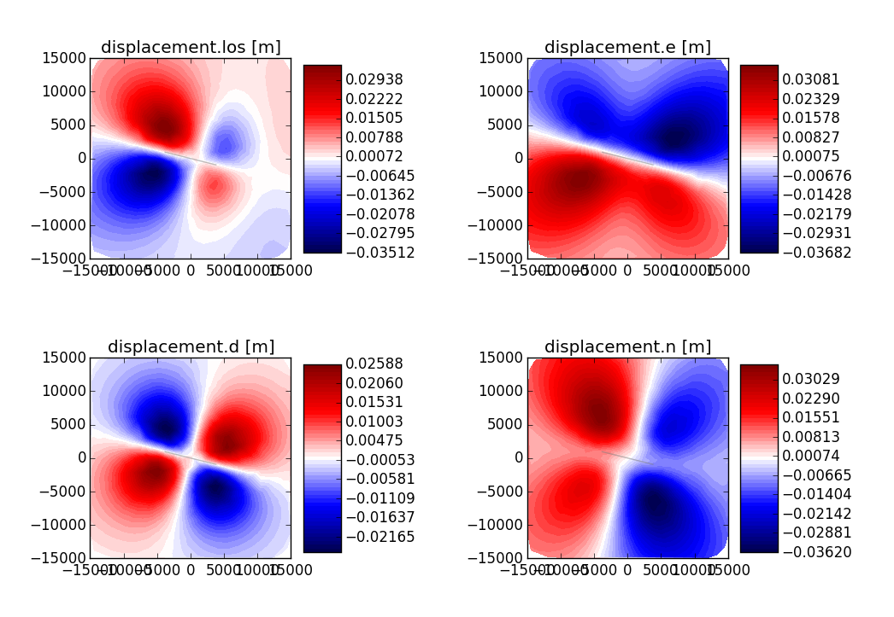

Forward Modeling synthetic seismograms and displacements
========================================================

Retrieve synthetic seismograms from a local store
--------------------------------------------------

.. highlight:: python

It is assumed that a :class:`~pyrocko.gf.store.Store` with store ID
*crust2_dd* has been downloaded in advance. A list of currently available
stores can be found at http://kinherd.org/gfs.html as well as how to download
such stores.

Further API documentation for the utilized objects can be found at :class:`~pyrocko.gf.targets.Target`,
:class:`~pyrocko.gf.seismosizer.LocalEngine` and :class:`~pyrocko.gf.seismosizer.DCSource`.

::

    from pyrocko.gf import LocalEngine, Target, DCSource
    from pyrocko import trace
    from pyrocko.gui_util import PhaseMarker

    # We need a pyrocko.gf.Engine object which provides us with the traces
    # extracted from the store. In this case we are going to use a local
    # engine since we are going to query a local store.
    engine = LocalEngine(store_superdirs=['/media/usb/stores'])

    # The store we are going extract data from:
    store_id = 'crust2_dd'

    # Define a list of pyrocko.gf.Target objects, representing the recording
    # devices. In this case one station with a three component sensor will
    # serve fine for demonstation.
    channel_codes = 'ENZ'
    targets = [
        Target(
            lat=10.,
            lon=10.,
            store_id=store_id,
            codes=('', 'STA', '', channel_code))
        for channel_code in channel_codes]

    # Let's use a double couple source representation.
    source_dc = DCSource(
        lat=11.,
        lon=11.,
        depth=10000.,
        strike=20.,
        dip=40.,
        rake=60.,
        magnitude=4.)

    # Processing that data will return a pyrocko.gf.Reponse object.
    response = engine.process(source_dc, targets)

    # This will return a list of the requested traces:
    synthetic_traces = response.pyrocko_traces()

    # In addition to that it is also possible to extract interpolated travel times
    # of phases which have been defined in the store's config file.
    store = engine.get_store(store_id)

    markers = []
    for t in targets:
        dist = t.distance_to(source_dc)
        depth = source_dc.depth
        arrival_time = store.t('p', (depth, dist))
        m = PhaseMarker(tmin=arrival_time,
                        tmax=arrival_time,
                        phasename='p',
                        nslc_ids=(t.codes,))
        markers.append(m)

    # Processing that data will return a pyrocko.gf.Response object.
    response = engine.process(source_dc, targets)

    # This will return a list of the requested traces:
    synthetic_traces = response.pyrocko_traces()

    # Finally, let's scrutinize these traces.
    trace.snuffle(synthetic_traces, markers=markers)

Retrieve spatial surface displacement from a local store
----------------------------------------------------------

In this example we create a :class:`~pyrocko.gf.seismosizer.RectangularSource` and compute the spatial static/geodetic displacement caused by that rupture.

We will utilize :class:`~pyrocko.gf.seismosizer.LocalEngine`, :class:`~pyrocko.gf.targets.StaticTarget` and :class:`~pyrocko.gf.targets.SatelliteTarget` in this example.

    Synthetic surface isplacement from a normal fault in east, north and vertical direction. The displacement in line-of-sight towards a satellite observer is given in the rightmost plot.

::

    from pyrocko.gf import LocalEngine, StaticTarget, SatelliteTarget,\
        RectangularSource
    import numpy as num

    km = 1e3

    # Ignite the LocalEngine and point it to fomosto stores stored on a
    # USB stick, for this example we use a static store with id 'static_store'
    engine = LocalEngine(store_superdirs=['/media/usb/stores'])
    store_id = 'static_store'

    # We define an extended source, in this case a rectangular geometry
    # Centroid UTM position is defined relatively to geographical lat, lon position
    rect_source = RectangularSource(
        lat=0., lon=0.,
        north_shift=0., east_shift=0., depth=6.5*km,
        width=5*km, length=8*km,
        dip=70., rake=90., strike=90.,
        slip=1.)

    # We will define 1000 randomly distributed targets.
    ntargets = 1000

    # We initialize the satellite target and set the line of sight vectors direction
    theta = num.empty(ntargets)  # Horizontal LOS from E
    theta.fill(num.deg2rad(90.-23.))

    phi = num.empty(ntargets)  # Vertical LOS from vertical
    phi.fill(num.deg2rad(192.))

    satellite_target = SatelliteTarget(
        north_shifts=(num.random.rand(ntargets)-.5) * 25. * km,
        east_shifts=(num.random.rand(ntargets)-.5) * 25. * km,
        tsnapshot=60,
        interpolation='nearest_neighbor',
        phi=phi,
        theta=theta)

    # The computation is performed by calling process on the engine
    result = engine.process(rect_source, [satellite_target])

    # Helper function for plotting the displacement
    def plot_static_los_result(result, target=0):
        import matplotlib.pyplot as plt

        N = result.request.targets[target].coords5[:, 2]
        E = result.request.targets[target].coords5[:, 3]
        result = result.results_list[0][target].result
        
        components = result.keys()
        fig, _ = plt.subplots(1, len(components))

        vranges = [(result[k].max(),
                    result[k].min()) for k in components]

        lmax = num.abs([num.min(vranges), num.max(vranges)]).max()
        levels = num.linspace(-lmax, lmax, 50)

        for dspl, ax in zip(components, fig.axes):
            #cmap = ax.imshow(E, N, result['displacement.%s' % dspl],
            #                      cmap='seismic', levels=levels)
            cmap = ax.tricontourf(E, N, result[dspl],
                                  cmap='seismic', levels=levels)
            ax.set_title(dspl)
            ax.set_aspect('equal')

        
            n, e = rect_source.outline(cs='xy').T
            ax.fill(e, n, color=(0.5, 0.5, 0.5), alpha=0.5)
        
        fig.colorbar(cmap)
        plt.show()

    plot_static_los_result(result)

Combining severals sources 
---------------------------
